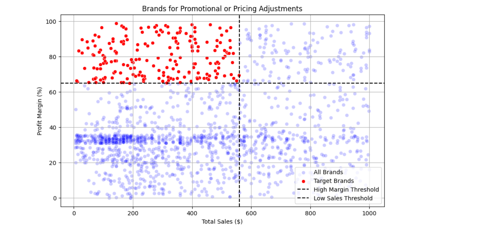
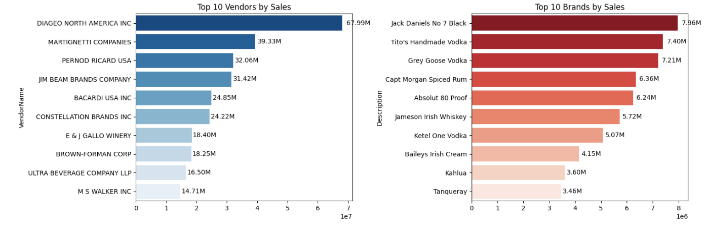
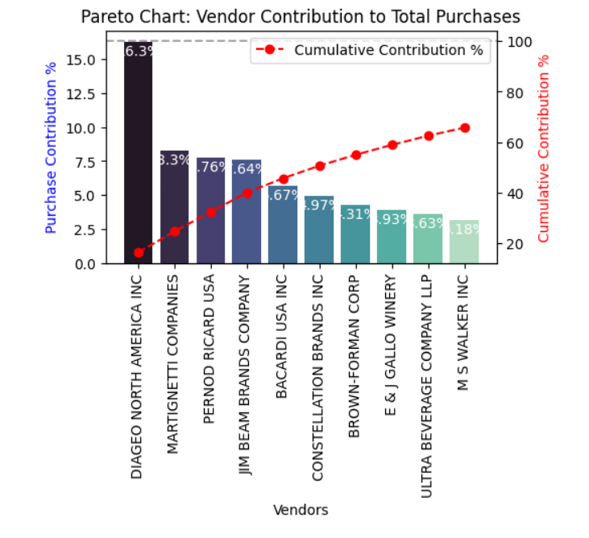
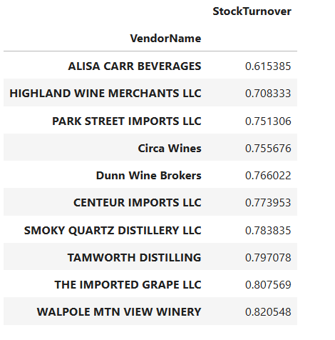
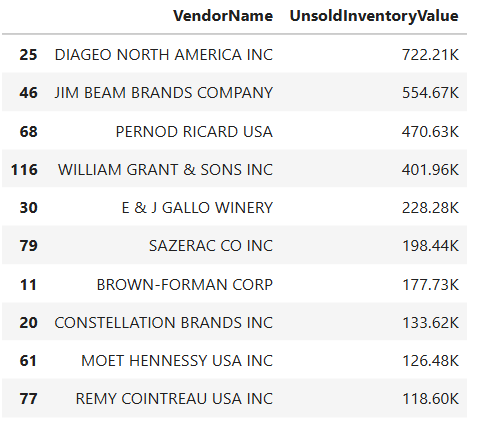
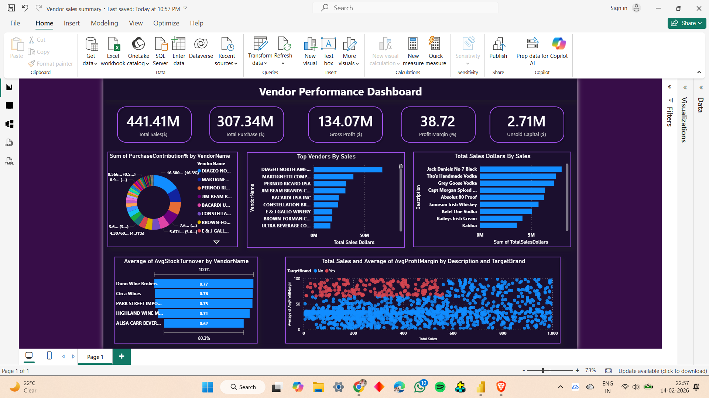

# 📊 Vendor Performance Data Analytics Pipeline

An end-to-end **Data Analytics Pipeline** built using Python, SQL, and Power BI to analyze vendor performance, procurement trends, and inventory insights.

This project demonstrates a real-world analytics workflow — starting from raw CSV ingestion to business intelligence dashboarding.

---

## 🚀 Project Overview

This project focuses on building a structured analytics pipeline that transforms raw vendor purchasing and sales data into actionable business insights.

The pipeline follows a layered architecture similar to industry-grade Data Engineering workflows:

- Automated Data Ingestion
- SQL-based KPI Transformation
- Business Analytics & Insights
- Power BI Visualization

---

## 🛠️ Tech Stack

- Python (Pandas, Logging)
- SQL / SQLite
- Power BI
- Jupyter Notebook
- Data Visualization (Matplotlib / Seaborn)

---

## ⚙️ Pipeline Flow

1. **ingestion_db.py** → Load raw CSV files into SQLite Database  
2. **get_vendor_summary.py** → Create Vendor KPI dataset using SQL transformations  
3. **Power BI Dashboard** → Visualization & Business Intelligence layer  

```
CSV Files → Python Ingestion → SQLite DB → KPI Transformation → Analytics → Power BI
```

---

## 🏗️ Data Engineering Architecture (Senior-Level Structure)

### 🔹 Data Ingestion Layer
- `ingestion_db.py`
- Reads raw CSV datasets
- Loads structured tables into SQLite database
- Includes logging for monitoring pipeline execution

### 🔹 Transformation Layer
- `get_vendor_summary.py`
- Uses SQL CTE queries to combine:
  - Purchases
  - Sales
  - Freight Cost
- Builds vendor-level KPI dataset

### 🔹 Analytics Layer
- `Exploratory Data Analysis.ipynb`
- `Vendor Perform Analysis.ipynb`
- Business problem solving using statistical and visual analysis

### 🔹 Visualization Layer
- Power BI dashboard built from transformed vendor summary dataset

---

## 🧮 Vendor KPI Transformation Pipeline

The `get_vendor_summary.py` script builds a vendor performance dataset by combining purchases, sales, and freight data using SQL CTE queries.

### Key Transformations

- Aggregated purchase and sales metrics
- Calculated business KPIs:
  - Gross Profit
  - Profit Margin
  - Stock Turnover
  - Sales-to-Purchase Ratio

The processed dataset is stored back into SQLite and used as the Power BI data source.

---

## 🔍 Exploratory Data Analysis (EDA)

The `Exploratory Data Analysis.ipynb` notebook follows a professional analysis structure:

- Data Understanding
- Data Cleaning & Validation
- Distribution Analysis
- Vendor Performance Exploration
- Purchase & Sales Trend Analysis
- Insight Generation

---

## 📊 Business Insights (Vendor Perform Analysis)

The notebook answers real-world business questions:

### 🔎 Q1 — Promotional or Pricing Adjustment Analysis


### 📈 Q2 — Top Vendors & Brands by Sales


### 🧾 Q3 — Vendor Contribution to Total Purchases (Pareto Analysis)


### 🥧 Q4 — Procurement Dependency on Top Vendors


### 📦 Q5 — Impact of Bulk Purchasing on Unit Price


### 📉 Q6 — Vendors with Low Inventory Turnover


### 💰 Q7 — Unsold Inventory Capital Analysis


### 📊 Q8 — Profit Margin Confidence Interval Analysis


---

## 📊 Power BI Dashboard

The final business intelligence layer is built using Power BI.

Features:

- Vendor KPI Overview
- Sales vs Purchase Analysis
- Profit Margin Tracking
- Inventory Performance Metrics



---

## 📂 Project Structure

```
vendor-performance-analytics/
│
├── ingestion_db.py
├── get_vendor_summary.py
├── Exploratory Data Analysis.ipynb
├── Vendor Perform Analysis.ipynb
├── README.md
│
└── images/
    ├── q1_promo_analysis.png
    ├── q2_top_sales.png
    ├── q3_pareto.png
    ├── q4_top_vendor_share.png
    ├── q5_bulk_price.png
    ├── q6_stock_turnover.png
    ├── q7_unsold_inventory.png
    ├── q8_confidence_interval.png
    └── dashboard.png
```

---

## ⚠️ Dataset Note

Large datasets and Power BI (.pbix) files are not included due to GitHub size limitations.

---

## 👨‍💻 Author

**Faizan Sheikh**  
Data Analyst | Python Developer
